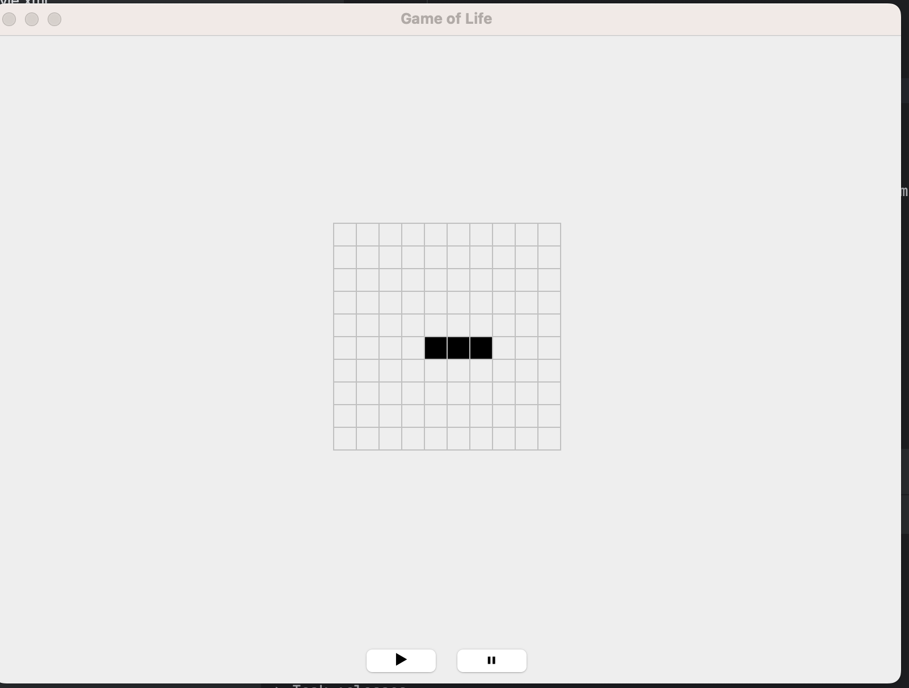

# Game of Life

This project is a Java implementation of Conway's Game of Life, a cellular automaton that simulates the evolution of cells on a grid based on a set of simple rules. 
It features an interactive graphical user interface (GUI), where users can toggle cells on or off and control the simulation with a play/pause button. 
The game evolves over time, demonstrating patterns that emerge from the initial configuration.

